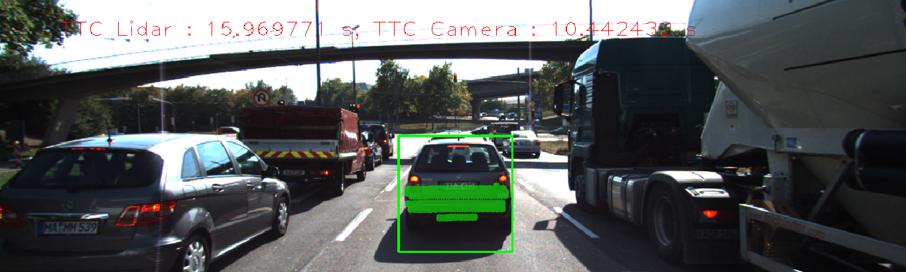

# SFND 3D Object Tracking

In this final project, I have completed four major tasks: 
1. First, I have developed a way to match 3D objects over time by using keypoint correspondences. 
2. Second, I have computed the TTC based on Lidar measurements. 
3. Then I have proceeded to do the same using the camera, which requires to first associate keypoint matches to regions of interest and then to compute the TTC based on those matches. 
4. And lastly, I have conducted various tests with the framework. The goal was to identify the most suitable detector/descriptor combination for TTC estimation and also to search for problems that can lead to faulty measurements by the camera or Lidar sensor. 

## Dependencies for Running Locally
* cmake >= 2.8
  * All OSes: [click here for installation instructions](https://cmake.org/install/)
* make >= 4.1 (Linux, Mac), 3.81 (Windows)
  * Linux: make is installed by default on most Linux distros
  * Mac: [install Xcode command line tools to get make](https://developer.apple.com/xcode/features/)
  * Windows: [Click here for installation instructions](http://gnuwin32.sourceforge.net/packages/make.htm)
* Git LFS
  * Weight files are handled using [LFS](https://git-lfs.github.com/)
* OpenCV >= 4.1
  * This must be compiled from source using the `-D OPENCV_ENABLE_NONFREE=ON` cmake flag for testing the SIFT and SURF detectors.
  * The OpenCV 4.1.0 source code can be found [here](https://github.com/opencv/opencv/tree/4.1.0)
* gcc/g++ >= 5.4
  * Linux: gcc / g++ is installed by default on most Linux distros
  * Mac: same deal as make - [install Xcode command line tools](https://developer.apple.com/xcode/features/)
  * Windows: recommend using [MinGW](http://www.mingw.org/)

## Basic Build Instructions

1. Clone this repo.
2. Make a build directory in the top level project directory: `mkdir build && cd build`
3. Compile: `cmake .. && make`
4. Run it: `./3D_object_tracking`.

## Project Rubric and Explanation

**FP. 1. Implement the method "matchBoundingBoxes", which takes as input both the previous and the current data frames and provides as output the ids of the matched regions of interest (i.e. the boxID property). Matches must be the ones with the highest number of keypoint correspondences.**

The code is implemented in the method "matchBoundingBoxes" in the camFusion_Student.cpp file. It involved looping through all of the keypoints, extracting their corresponding keypoints from the matches and checking if they lie within the roi defined within the bounding boxes. If they do, the boundingBox IDs are pushed into a multimap. The highest number of correspondences for each bounding box is then counted in the multimap.  

**FP. 2. Compute the time-to-collision in seconds for all matched 3D objects using only Lidar measurements from the matched bounding boxes between current and previous frame.**

The code for the same has been implemented in the method " computeTTCLidar". It involves calculating the mean of the cropped lidar points from the previous frame and the current frame and using their difference to calculate the TTC, since a mean is more robust than using the closest lidar to the host.

**FP. 3. Prepare the TTC computation based on camera measurements by associating keypoint correspondences to the bounding boxes which enclose them. All matches which satisfy this condition must be added to a vector in the respective bounding box.**

The method "clusterKptMatchesWithROI" was used to implement the code for the same. It involved looping through the keypoints in the current frame and checking if the keypoint lies within the ROI of the bounding box. If the keypoints lie within the boundingBox, the keypoint and its corresponding match are pushed to the boundingbox's keypoint matches.

**FP. 4. Compute the time-to-collision in second for all matched 3D objects using only keypoint correspondences from the matched bounding boxes between current and previous frame.**

The TTC for Camera is calculated in the method "ComputeTTCCamera" using the distance ratios for the keypoints correspondences. The same is calculated using different combinations of detector-descriptors.

**FP. 5. Find examples where the TTC estimate of the Lidar sensor does not seem plausible. Describe your observations and provide a sound argumentation why you think this happened.**

The TTC estimate for the Lidar was found to be noisy and too high and too low for several of the images. The TTC Lidar is expected to behave in a more robust way and not jump around to such an extent between frames. Some reasons of this behavior could be: 
1. The TTC estimate equation does not take into account the acceleration with respect to the preceding car since the equation is constant- velocity based. 
2. The number of frames taken into account for each TTC calculation is only 2. This is unrealitic since it could lead to noisy estimates as small variations in lidar measurements between frames could lead to undue variations in the TTC.

Below are some of the images where you can clearly see the discordance between camera and lidar TTCs.

**FP.6. Run several detector / descriptor combinations and look at the differences in TTC estimation. Find out which methods perform best and also include several examples where camera-based TTC estimation is way off. As with Lidar, describe your observations again and also look into potential reasons.**

Several detector-descriptor combinations were performed and the Camera and Lidar based TTCs were calculated.

|A        |B         |C      |D      |E      |F       |G      |H      |I       |J      |K      |L       |M       |N       |O       |P       |Q       |R       |S       |T       |
|---------|----------|-------|-------|-------|--------|-------|-------|--------|-------|-------|--------|--------|--------|--------|--------|--------|--------|--------|--------|
|Detector |Descriptor|Frame 1|Frame 2|Frame 3|Frame 4 |Frame 5|Frame 6|Frame 7 |Frame 8|Frame 9|Frame 10|Frame 11|Frame 12|Frame 13|Frame 14|Frame 15|Frame 16|Frame 17|Frame 18|
|SIFT     |FREAK     |15.2604|15.2864|15.3125|-230.158|21.4036|22.0939|-65.4052|24.8634|32.2384|12.3449 |12.8302 |13.3739 |9.70096 |10.4019 |10.7043 |10.605  |8.62812 |9.23257 |
|SIFT     |BRIEF     |12.2845|13.5379|13.5201|20.9118 |13.6163|11.368 |13.782  |16.2113|13.1293|10.082  |12.1619 |11.1606 |10.3257 |9.86393 |9.31094 |8.93934 |8.68319 |8.91607 |
|SIFT     |BRISK     |12.0668|13.9122|14.2733|25.2825 |19.3959|11.4788|15.7548 |13.7438|13.4564|11.2525 |11.1018 |12.0515 |10.582  |10.6446 |9.61172 |10.1915 |8.8729  |8.50408 |
|AKAZE    |ORB       |12.5102|14.4194|13.4629|14.421  |15.1076|13.9485|15.4664 |13.9923|12.8613|11.5973 |12.0779 |12.2759 |10.2485 |10.3685 |10.3622 |9.9912  |8.76697 |8.68845 |
|AKAZE    |FREAK     |13.0542|14.1024|13.2145|14.3051 |16.2294|14.7878|15.1715 |14.5304|14.8459|11.6128 |12.1969 |10.8751 |11.1849 |9.61153 |9.38028 |10.2148 |9.24693 |8.57646 |
|AKAZE    |BRIEF     |12.8274|14.6497|12.9268|14.2765 |14.9715|12.9716|15.8094 |14.2801|13.7728|11.8871 |12.6005 |11.5656 |10.1268 |10.0393 |9.60156 |10.1259 |9.39664 |9.14105 |
|AKAZE    |BRISK     |12.2628|14.1479|13.0918|15.0414 |14.4985|14.6043|16.1854 |14.4514|13.7464|11.6128 |12.2829 |10.5347 |10.4493 |10.3073 |9.69097 |10.0291 |9.12927 |8.91309 |
|ORB      |ORB       |18.932 |10.5162|14.2428|125.973 |45.5018|40.986 |212.217 |8.4797 |15.0839|13.2504 |7.43458 |29      |9.47926 |12.8068 |12.6136 |9.78779 |17.2956 |28.0396 |
|ORB      |FREAK     |12.2359|38.7882|10.8292|11.1387 |156.224|11.1136|472.207 |10.0855|12.8711|29      |7.95795 |27.777  |6.86843 |57.3947 |8.73093 |7.46502 |11.3219 |7.62862 |
|ORB      |BRIEF     |12.9942|16.2011|22.8479|20.3653 |20.0926|102.985|22.677  |23.5377|28.762 |11.0336 |10.172  |21.9028 |13.918  |8.65968 |13.7016 |15.2432 |18.3336 |16.8264 |
|ORB      |BRISK     |14.3109|12.4561|15.1614|49.2044 |29     |9.55196|216.716 |11.9978|11.8755|11.6259 |7.37615 |29      |10.1193 |9.47411 |11.4778 |10.9804 |14.4745 |32.5198 |
|BRISK    |ORB       |12.671 |15.5735|13.9183|17.6583 |23.751 |18.0278|18.1338 |15.7639|14.8318|12.9748 |13.9691 |10.9041 |11.7249 |10.6695 |13.8756 |10.7676 |9.72169 |12.5335 |
|BRISK    |FREAK     |15.6779|18.9662|13.6337|13.9885 |23.9535|14.6643|19.3294 |20.7027|17.7537|14.5525 |12.792  |13.696  |13.0474 |12.2443 |12.8674 |9.94936 |8.76408 |10.7817 |
|BRISK    |BRIEF     |12.4907|19.6652|12.1592|22.4167 |21.7089|18.8909|16.0237 |19.0534|14.5564|12.2603 |12.2461 |14.2445 |12.3206 |11.5699 |10.5553 |13.4594 |11.063  |10.404  |
|BRISK    |BRISK     |12.364 |18.9811|11.8946|21.5749 |31.0496|14.039 |18.9262 |16.8197|13.9191|12.6973 |12.8176 |11.2152 |12.1919 |10.9295 |12.0652 |10.3943 |9.66682 |10.7753 |
|FAST     |ORB       |11.6137|12.5287|16.6265|13.1636 |29     |12.5073|15.5783 |12.1201|12.0205|14.0112 |13.7238 |12.3705 |11.678  |11.6295 |11.8    |11.4484 |11.0288 |11.6009 |
|FAST     |FREAK     |12.6032|23.0448|13.6008|12.8651 |29     |13.1788|16.8088 |12.4352|12.3176|13.3275 |13.3673 |12.273  |11.428  |10.943  |11.4314 |13.7065 |11.7261 |11.7904 |
|FAST     |BRIEF     |11.9301|12.5319|14.9945|13.1818 |102.236|12.9934|13.2787 |12.0531|11.7216|13.7102 |13.1636 |12.4803 |11.2461 |11.7158 |12.1403 |12.2566 |11.3035 |10.9411 |
|FAST     |BRISK     |12.313 |14.2376|12.9   |12.6839 |29     |14.9284|12.828  |11.8227|11.7306|14.4421 |23.386  |12.2258 |11.438  |11.1134 |12.0184 |12.6012 |10.1026 |12.0072 |
|HARRIS   |ORB       |14.038 |11.9056|14.7512|13.518  |12.6318|13.5019|14.1184 |13.2228|12.2022|13.1432 |12.3278 |11.5174 |11.6247 |12.1726 |8.82507 |11.7538 |9.19583 |12.5741 |
|HARRIS   |FREAK     |13.5727|12     |20.5083|13.8255 |11.3502|13.5019|15.1159 |13.9505|12.398 |13.0141 |13.2592 |13.4283 |12.1119 |13.8873 |9.11132 |11.1691 |9.2762  |11.9908 |
|HARRIS   |BRIEF     |13.5727|11.4982|13.2483|23.0086 |12.7626|12.9506|13.5472 |12.5157|12.2988|12.9826 |12.8506 |11.1811 |12.1365 |12.1726 |9.50729 |12.1312 |9.69202 |12.3202 |
|HARRIS   |BRISK     |12.3202|11.7009|14.3167|13.6445 |11.6402|29.9129|13.1513 |13.5328|11.7977|13.3479 |13.456  |12.7949 |11.8956 |13.0781 |9.21502 |11.7261 |9.69202 |12.9405 |
|SHITOMASI|ORB       |14.4892|12.192 |11.6   |13.1113 |12.3705|13.2282|13.044  |12.6218|11.5656|13.4726 |11.8969 |11.2543 |11.7243 |10.8893 |10.1226 |11.5882 |10.9456 |8.11627 |
|SHITOMASI|FREAK     |25.3921|14.5935|12.0411|13.5777 |12.8167|14.8982|19.1253 |13.2998|11.4727|14.7917 |12.0367 |13.3156 |13.36   |13.1872 |10.5473 |11.1729 |11.204  |9.92931 |
|SHITOMASI|BRIEF     |14.563 |13.3176|10.4424|14.2567 |12.1376|13.9065|16.1445 |12.6218|11.9106|12.8285 |11.6681 |11.6231 |11.6034 |11.0575 |11.7306 |11.9741 |11.1337 |7.92121 |
|SHITOMASI|BRISK     |14.5798|15.8668|16.4474|12.6742 |14.297 |33.1589|12.9475 |14.4581|11.9735|15.3339 |14.6686 |13.1103 |12.5802 |12.5597 |8.54737 |12.4587 |11.94   |10.5152 |
|LIDAR    |          |11.9823|13.0188|15.9698|13.7176 |12.4029|13.3952|13.3735 |13.4281|11.7398|11.5475 |11.646  |9.61828 |9.16605 |9.04379 |8.08731 |8.64574 |10.7138 |8.28789 |

Based on the above data, we can see that there were several instances where the TTC estimate for Camera was way off compared to Lidar. The best combination was found to be SHITOMASI-ORB and AKAZE-BRIEF. 

